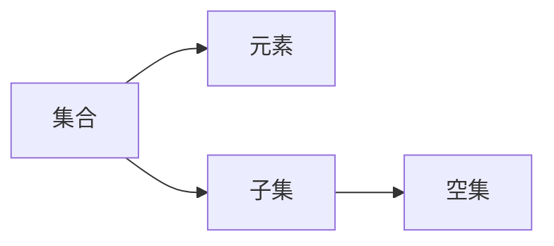

# export_formats Skill

## 什么时候使用这个 Skill

当用户需要以下操作时使用此 Skill：

- 将知识库导出为可打印的 PDF 文档
- 生成 Markdown 格式的学习笔记
- 创建思维导图用于复习
- 生成 HTML 格式的现代文档（适合打印）
- 将结构化知识转换为可阅读的文档
- 分享知识给其他人

## 📁 默认导出行为

**重要**：默认情况下，导出 md 和 html 格式时会**按章节分割**：

- 每个章节生成**独立的 md 文件和 html 文件**
- 文件名格式：`学科名_章节名.md` 和 `学科名_章节名.html`
- 例如：`数学_第1章-集合.md`、`数学_第1章-集合.html`

这样做的优势：
1. 便于单独复习某个章节
2. 文件大小适中，加载快速
3. 方便分享特定章节内容

## 🎨 智能设计美化

**HTML 导出时会自动应用设计美化**：

- **智能配色**：根据学科和内容自动选择适合的配色方案
- **字体优化**：选择清晰易读的字体组合
- **现代样式**：应用现代、专业的UI设计
- **响应式布局**：适配不同设备屏幕

设计配置来自 **design skill**，包含：
- 67 种 UI 风格
- 161 种配色方案
- 57 种字体配对
- 专业的 UX 指南

## 🎨 视觉重构协议 (Visual Reconstruction Protocol)

**重要**：当提取到内容后，**严禁**直接按顺序罗列文字。必须执行以下"三步美化法"：

### 第一步：结构模块化 (Structure)

将杂乱内容重组为以下固定模块，每个模块使用特定的 Markdown 语法增强视觉效果：

#### 1. 📌 核心结论 (Key Takeaways)
- 使用 `> [!SUMMARY]` 警告框语法
- 仅列出 3-5 个最关键的考点，加粗关键词
- *目的：一眼看到重点，模拟 PPT 的标题页*

```markdown
> [!SUMMARY] 📌 核心结论
> - **知识点1**：简要描述...
> - **知识点2**：简要描述...
```

#### 2. 🧠 知识图谱 (Knowledge Map)
- 如果内容涉及流程、关系或架构，**必须**生成 `mermaid` 流程图代码块
- 如果内容涉及对比（如 A vs B），**必须**生成 Markdown 表格
- *目的：用图形替代枯燥文字，还原 PPT 的图表优势*

```markdown
## 🧠 知识图谱

### 📊 概念关系图


### 📋 对比分析

| 特性 | 内容 |
|------|------|
| A | 描述... |
```

#### 3. 📖 详细解析 (Deep Dive)
- 使用层级分明的列表 (`-`, `  -`)
- 定义/公式：使用 LaTeX 格式 ($...$) 或代码块
- 易错点：使用 `> [!WARNING]` 红色警示框标记

#### 4. ⚡ 考前自测 (Active Recall)
- 基于内容生成 3 道简答题
- **关键技巧**：使用 HTML `<details>` 标签折叠答案，实现"点击揭晓"

```markdown
## ⚡ 考前自测

### 问题 1
请简述 **XXX** 的定义。

<details>
<summary>👉 点击查看参考答案</summary>

这里是答案内容...

</details>
```

### 第二步：样式增强 (Styling)
- **加粗策略**：每段话中，必须将**核心名词**和**动词**加粗，禁止整句加粗
- **Emoji 引导**：在每个小标题前添加相关的 Emoji (如 📊, 💡, ❌)，增加视觉锚点
- **留白艺术**：模块之间必须空两行，避免拥挤

### 第三步：输出格式选择
- **默认模式**：输出标准 Markdown (.md)，适配 Obsidian/Notion
- **打印模式**：若用户提及"打印"或"美观"，直接输出单文件 **HTML** 代码（内嵌 CSS，模仿现代文档风格，带侧边目录和柔和配色）

## 你的任务

你是一个格式转换专家，负责将结构化的知识库转换为各种可阅读的格式。

### 步骤 1：读取知识库

1. **加载知识库文件**
   - 读取 JSON 格式的知识库
   - 解析章节结构和知识点

2. **分析内容范围**
   - 确定要导出的章节范围
   - 统计知识点数量
   - 识别知识点类别分布

### 步骤 2：根据格式要求生成内容

#### 格式 1：Markdown (.md) - 视觉重构协议版

生成结构化的 Markdown 文档：

```markdown
# 📚 知识点总结

> **版本**: 1.0.0 | **更新时间**: 2024-01-15T10:30:00Z
> **知识点总数**: 25

---

## 📖 目录

1. [第1章 集合](#第1章-集合) (10个知识点)
2. [第2章 函数](#第2章-函数) (15个知识点)

---

## 📑 第1章 集合

> [!SUMMARY] 📌 核心结论
> - **集合的定义**：把具有共同特征的事物或对象汇总在一起的结果
> - **元素**：集合中的每个对象称为元素
> - **表示方法**：列举法、描述法、图示法

## 🧠 知识图谱

### 📊 概念关系图



## 📖 详细解析

### 📝 定义

#### 集合的定义

集合是把具有共同特征的事物或对象汇总在一起的结果。

🔗 **相关概念**: 元素, 子集, 空集

---

### 📐 公式

#### 密度计算公式

**📐 公式**: $\rho = \frac{m}{V}$

| 符号 | 含义 | 单位 |
|:----:|------|------|
| ρ | 密度 | g/cm³ |
| m | 质量 | g |
| V | 体积 | cm³ |

---

## ⚡ 考前自测

> [!TIP] 💡 点击下方箭头查看参考答案

### 问题 1
请简述 **集合** 的定义。

<details>
<summary>👉 点击查看参考答案</summary>

集合是把具有共同特征的事物或对象汇总在一起的结果。集合中的每个对象称为元素。

</details>

---

## 📝 复习建议

> [!NOTE] 🎯 高效复习策略
> 
> 1. **概念理解** - 重点理解各概念的定义和内涵
> 2. **公式记忆** - 熟练掌握重要公式的推导和应用
> 3. **例题练习** - 通过例题加深对知识点的理解
> 4. **关联复习** - 注意知识点之间的联系和区别

---

*📅 生成时间: 2024-01-15 10:30:00*
```

**格式要求**：
- 使用 `#` 标题层级区分章节目录
- 使用 `**粗体**` 突出关键信息
- 使用 `---` 分隔不同知识点
- LaTeX 公式使用 `$...$` 行内格式
- 表格使用 Markdown 表格语法
- 每章节末尾添加"课后思考"板块
- 文档末尾添加"复习建议"板块
- 使用 emoji 图标区分不同类型知识点
- **必须遵循视觉重构协议**

#### 格式 2：HTML (.html) - 现代文档风格

生成单文件 HTML，内嵌 CSS，适合打印：

**特性**：
- 侧边目录导航
- 柔和配色方案（蓝色主题）
- 响应式布局
- 打印优化（隐藏侧边栏）
- 核心结论高亮框
- 折叠答案交互

#### 格式 3：思维导图 (.mm)

生成 FreeMind 格式的 XML：

```xml
<?xml version="1.0" encoding="UTF-8"?>
<map version="0.9.0">
  <node TEXT="知识库">
    <node TEXT="第1章-集合">
      <node TEXT="集合的定义" NOTE="概念"/>
      <node TEXT="集合的表示方法" NOTE="定义"/>
    </node>
  </node>
</map>
```

#### 格式 4：PDF 文档

生成可打印的 PDF 文件：
- 封面：标题 + 日期 + 版本号
- 正文：章节分组，知识点依次排列

### 步骤 3：保存文件

1. **创建输出目录**（如果不存在）
2. **生成文件名**
   - 使用知识库名称或默认名称
   - 包含导出日期
3. **写入文件内容**

### 步骤 4：输出结果

按章节分割导出时的输出示例：

```json
{
  "status": "success",
  "files": [
    {
      "format": "md",
      "chapter": "第1章 集合",
      "path": "/output/数学_第1章-集合.md",
      "size": 5120
    },
    {
      "format": "html",
      "chapter": "第1章 集合",
      "path": "/output/数学_第1章-集合.html",
      "size": 15360
    },
    {
      "format": "md",
      "chapter": "第2章 函数",
      "path": "/output/数学_第2章-函数.md",
      "size": 6144
    },
    {
      "format": "html",
      "chapter": "第2章 函数",
      "path": "/output/数学_第2章-函数.html",
      "size": 18432
    }
  ],
  "summary": {
    "total_chapters": 2,
    "total_points": 50,
    "formats_generated": 4
  }
}
```

## 输出要求

1. **格式正确**：每种格式都要符合对应规范
2. **内容完整**：不遗漏任何知识点
3. **可读性好**：生成的文档要易于阅读
4. **结构清晰**：层次分明，便于导航
5. **视觉美化**：遵循视觉重构协议

## 错误处理

如果导出失败，根据具体情况返回错误：

- **知识库不存在**：`{"status": "error", "error": "Knowledge base not found"}`
- **无效格式**：`{"status": "error", "error": "Invalid format: <format>"}`
- **输出目录无效**：`{"status": "error", "error": "Invalid output directory"}`
- **写入失败**：`{"status": "error", "error": "Write failed: <具体原因>"}`

## 可选的辅助工具

如果需要自动化导出，可以使用 `scripts/export.py` 脚本：

```bash
# 导出为 Markdown 和 HTML（默认按章节分割）
python scripts/export.py --base "/db/knowledge.json" --formats "md,html" --output "/output"

# 指定学科名称（用于文件名）
python scripts/export.py --base "/db/knowledge.json" --formats "md,html" --output "/output" --subject "数学"

# 不按章节分割，导出为单个文件
python scripts/export.py --base "/db/knowledge.json" --formats "md,html" --output "/output" --no-split

# 仅导出 HTML（适合打印）
python scripts/export.py --base "/db/knowledge.json" --formats "html" --output "/output"

# 导出所有格式
python scripts/export.py --base "/db/knowledge.json" --formats "md,html,pdf,mindmap" --output "/output"
```

**注意**：脚本是可选的辅助工具，你也可以直接生成对应格式的文件。

## 后续步骤

导出完成后，工作流结束。如果需要构建检索索引，可以调用 **build_index** Skill。
